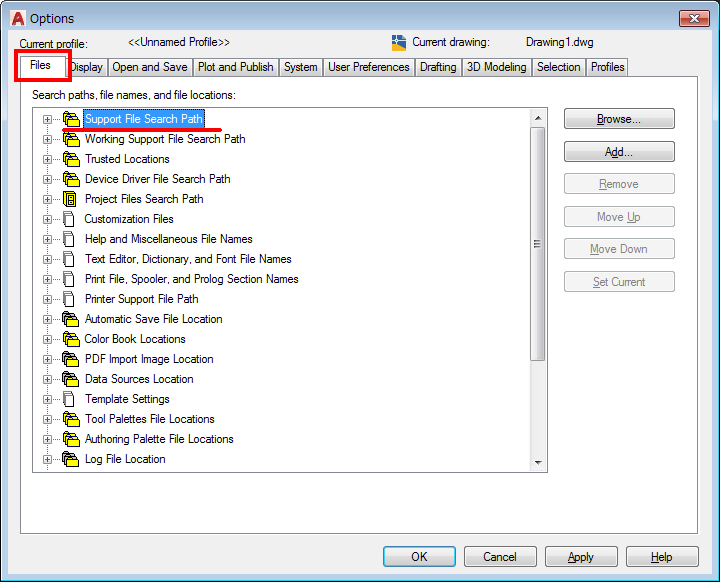
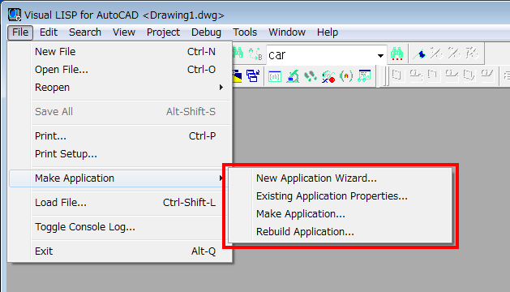
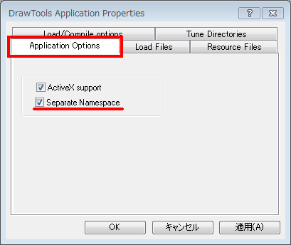
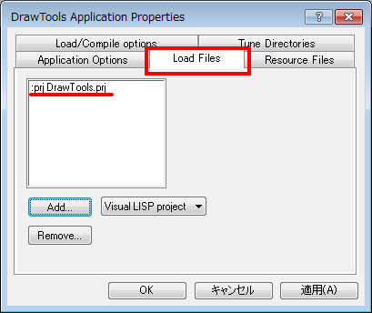
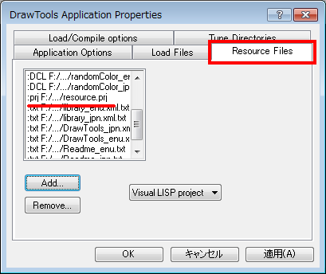

# include


# INTRODUCTION

AutoLISP has a load function that allows you to load the required functions from other files. But since it is a simple operation, you must always keep mind of which files are loaded. Therefore, a library system that automatically loads necessary functions cannot be used in the Visual LISP IDE. This library system is built by defining an include function that extends the load function. The main difference between the include function and load function is that the already loaded files are remembered and not loaded unnecessarily.

In addition to existing libraries that assume include function, by organizeing your own highly reusable functions in a different folder from the folder of the program you are writing, in the same way, You can make your own library.

When this system is built, functions are automatically loaded, but it is difficult to know which functions are to be loaded. This makes it difficult to use the program in other than the AutoLISP execution environment used for development. Therefore, it is necessary to finally combine the program you wrote and the functions of the required library into one [Separate-namespace VLX applications]. By using [Separate-namespace VLX applications], you can create a program that is easy to handle with one file and that operates without interference in the AutoLISP execution environment of other AutoCAD users.

The list of function files loaded and stored by the include function can be exported to the Visual LISP project file format. This can be used as a resource in the application definition file when you finish up your program as [Separate-namespace VLX applications].

# ABOUT LICENSE

The function source code is a MIT license. The MIT license is one of the open source software licenses that has few restrictions.

The outline of the MIT license is translated into this case as follows.
* No warranty!
* Anyone can use the source code of this function for free. You can freely distribute and change the source code, including commercial use, and create programs that use it.
* When redistributing or changing the source code of this function, the following copyright notices already included in this must not be erased. Also, when you try to distribute your program created using this, please display the following three copyright notice lines in appropriate place where we can confirm, such as another file for the license display that is included.
```
Copyright (c) 20xx manual chair japan
Released under the MIT license
https://opensource.org/licenses/mit-license.php
```

# USAGE

## STEP 1 - BUILDING A LIBRARY SYSTEM

### Set Support File Search Path

1. Set [Support File Search Path] of AutoCAD.

Set the path to the library. You can put the libraries that depend on the include function or libraries that you want to create on your own wherever you want. However, for the path up to that, please set the [Support file search path] of AutoCAD. This setting can be set from the [Files] tab of the dialog displayed by the OPTIONS command of AutoCAD.


 
Depending on the version of AutoCAD, make settings so that the folder is included in the [trusted Location].

### Load Include Function

2. Load include function in AutoLISP development environment of AutoCAD.

The include function loads a function from a library. In advance, load this function into the development environment from the **include-lib.LSP** file from acaddoc.LSP etc.


When this file is loaded, the definition of include function and exportresouce function that writes a list of files loaded using include function to the Visual LISP project file are defined. Also, the global variable \ * DrawingLevelEnviromet \ * is set to T.

This completes the library system settings.

Subsequent program development work is better done using Visual LISP projects.

## STEP 2 - DEVELOP PROGRAMS

### Include Function For Separate-namespace VLX Applications

3. Register the include function for [Separate-namespace VLX applications] at the top of your project.

When the program is finally created as [Separate-namespace VLX applications], the library functions are loaded from within the resource. In this case, use an include function that target resources different from the include function used during development. This function is defined in **include.lsp**.

Register this file at the top of the project file of the program you are creating, so that it is included in the [Separate-namespace VLX applications]. This include function skips the definition while \*DrawingLevelEnviromet\* is T even if the file is registered in the project, and is activated only in the [Separate-namespace VLX applications].


### Include Statement

4. Write the include function statement in your program.

Complete your program while loading library functions in time with the include function. If you write the following statement in your program, a file containing necessary functions will be loaded from the library as needed.

```lisp
(include 'default "./common/default")
```

The first argument of the include function is the name of the function that requires it, and the second argument is the file-name in which the function is defined. In the above example, if the default function is not defined, it means to load the "./common/default" file. The file name is described as a relative path from the AutoCAD [Support File Search Path].


## STEP 3 - CREATE SEPARATE-NAMESPACE VLX APPLICATION

### Create Project File of Library Function List

5. Use the exportresouce function to export a list of library functions as a project file.

When your program is completed, write a list of functions used from the library to a Visual LISP project file to create your [Separate-namespace VLX applications]. Since this process writes out what the include function loaded during the development process, unnecessary functions may have been loaded during trial and error. Therefore, reset the AutoLISP execution environment once, load your program again, and make sure that unnecessary functions are not included. When the exportresouce function is executed from [Console], a dialog to save the file appears. Specify the file name and save.

```lisp
_$ (exportresource) ⏎

; Resouce files was exported as project file.
; F:\VisualLISP\resource\DrawTools\resource.prj
```

### Check Temporary Folder

6. Check the temporary folder in the project file of the library function list.

The temporary folder used in the options related to compiling in the project file is fixed in the temp folder where this project file is located.

If necessary, open the project file and change the folder or create the folder.

```lisp
  :FAS-DIRECTORY
  "./temp"
  :TMP-DIRECTORY
  "./temp"
```

### Set application definition file

7. Check [Separate Namespace] on the [Application Options] tab.
8. Register your project file in [Load Files].
9. Register the project file of the library function list in the [Resource Files] tab.
10. Create a VLX application from the [File]→[Make Application] menu of Visual LISP.

Use the Visual LISP menu [File]→[Make Application]→[New Application Wizard] or [Existing Application Properties] to set the [VLX Application] make file.
 


Check [Separate Namespace] on the [Application Options] tab of the [~ Application Properties] dialog.
 


Next, register the project file of the program you created in the [Load Files] tab.
 


The project file that contains the library function list is registered on the [Resource Files] tab.
 


Other application settings should be set as appropriate for your program.

After the above settings are completed, create a [VLX application] from the Visual LISP menu [File]→[Make Application]→[Make Application] or [Rebuild Application].

After resetting the AutoLISP execution environment again, load the created [VLX application] and test whether it works properly.

### About Trouble Loading VLX Application

Even if the [VLX application] is loaded into AutoCAD using the APPLOAD command and "~ was successfully loaded" is displayed, an error may occur during loading and the program may not be able to be executed. If it worked properly during development, it is most likely because there was a leak in packing the library functions in the [Separate-namespace VLX application]. Check the following and try to create the [VLX application] again.

* Again, create a project file of the library function list and update it to the latest state.

* If you have already created the [VLX application], the project file of the previous library function list is opened in Visual LISP at the time of creation. The opened project file takes precedence over the contents of the file, so be sure to close the previous project file from [Project]→[Close Project].

* If the above does not solve the problem, try to reproduce the load failure of the [VLX application] from the APPLOAD command with Visual LISP open. Therefore, if you display the [Error Trace] of Visual LISP, you may be able to get information on what caused the error. A possible cause here is that the functions by the external [ObjectARX application] was forgotten to be imported into its Separate-namespace. In this case, for example, include the following declaration in your program.

       (vl-arx-import 'startapp)

(EOF)