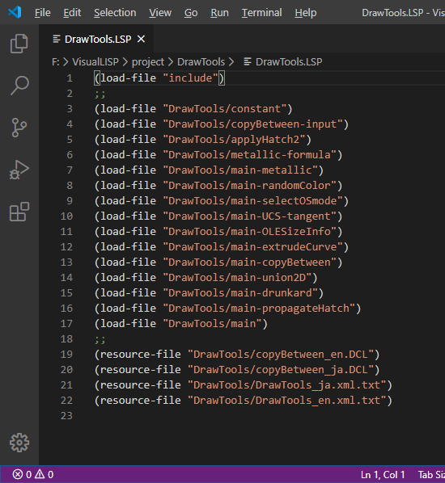

# include


# 概要

このライブラリシステムは include 関数を代表とするいくつかの関数で構成され、AutoLISP の開発環境において必要な外部関数のファイルをロードする仕組み等を提供します。そしてロードした関数のリストを Visual LISP のプロジェクトファイルや【VLX アプリケーション】の定義ファイルとして作成することができます。これらを使って【VLX アプリケーション】を作成するのが最終的な目的です。

AutoLISP には load 関数があり、他のファイルから必要な関数をロードすることができます。しかしそれは単純な動作のため、常にロードされるファイルを把握しておかなければなりません。そのため、必要な関数を効率よく自動でロードするライブラリのようなシステムを元々の AutoLISP 実行環境では利用できません。ここでは、load 関数を拡張した include 関数を定義してライブラリシステムを構築します。include 関数と load 関数との主要な違いは、既にロードしたファイルは記憶しておいて不要なロードは行いません。

include 関数を前提とした既存のライブラリに加えて、あなたの作った再利用性の高い独自の関数を、今書いているプログラムとは別のフォルダに同じ要領で整理することで、あなた自身のライブラリを作っていくことができます。

include 関数を使用すると自動で関数がロードされる一方で、どの関数がロードの対象になるのか把握することは困難になります。そのためプログラムの開発に使った AutoLISP 実行環境以外の他で利用することは困難になります。このことから最終的にあなたの書いたプログラムと必要なライブラリの関数を合わせて一つの【独自の名前空間 VLX アプリケーション】として仕上げることが必要になります。【独自の名前空間 VLX アプリケーション】とすることで、一つのファイルで扱いやすく、他の AutoCAD ユーザーの AutoLISP 実行環境においても干渉せずに動作するプログラムとすることができます。

include 関数がロードして記憶しておいた関数のファイルのリストを Visual LISP のプロジェクトファイルの形式に書き出すことができます。これは、あなたのプログラムを【独自の名前空間 VLX アプリケーション】として仕上げる際にアプリケーション定義ファイルのリソースとして使用できます。また、Visual LISP のプロジェクトが使えない Visual Studio Code の開発環境用には、直接【VLX アプリケーション】の定義ファイルを作成することもできます。そのために include 関数に加えて load-file 関数と resource-file 関数を使って少しの手間が必要です。これは Visual LISP でアプリケーション定義ファイルを手動で編集していたのに対応するものです。

# ライセンスについて

本関数のソースコードについては、MIT ライセンスとします。MIT ライセンスはオープンソースソフトウェアのライセンスの一つで、制約が少ししかないものです。

MIT ライセンスのあらましを本件にあわせて意訳すると以下の通りです。
* 無保証です！
* 本関数のソースコードは誰でも無料で使用できます。商用を含めて、自由にソースコードの配布や変更を行うこと、これ使ったプログラムの作成ができます。
* 本関数のソースコードの再配布や変更を行う場合、これらに既に含まれている下記の著作権表示は消してはいけません。また、この関数を使用して作成したあなたのプログラムを配布しようとするときの著作権表示には、同じく下記の著作権表示の三行を、同梱するライセンス表示用の別ファイルなど適当な、しかし確認できるところに明示してください。
```
Copyright (c) 20xx manual chair japan
Released under the MIT license
https://opensource.org/licenses/mit-license.php
```

# ライブラリシステムの事前準備

## サポートファイルの検索パスの設定

1. AutoCAD の【サポートファイルの検索パス】の設定をする。

ライブラリへのパスの設定を行います。include 関数を前提とした他から入手したライブラリやあなたが独自に作ろうとしているライブラリを置くフォルダは、あなたが好きなところに置くことができます。しかしそこまでのパスは AutoCAD の【サポートファイルの検索パス】の設定を行ってください。この設定は、AutoCAD の OPTIONS コマンドで表示されるダイアログの【ファイル】タブから設定できます。


 
AutoCAD のバージョンによっては【信頼できるフォルダ】に該当のフォルダを含める設定を行ってください。

## include 関数やその他関数の定義

2. AutoCAD の AutoLISP 開発環境に include 関数をロードして使用可能にする。

include 関数はライブラリから関数をロードします。この関数は **include-lib.LSP** ファイルを acaddoc.LSP などから前もって開発環境にロードしておきます。


このファイルをロードすると、include 関数やこの関数を使ってロードしたファイルの一覧を書き出す関数など一連の関数が定義されます。また、グローバル変数 \*DrawingLevelEnviromet\* が T にセットされます。

以上でライブラリシステムの設定は終わりです。以降はプログラム開発過程の手順を説明します。手順はVisual Studio Code を使っている(CASE 1)か、 Visual LISP を使っている(CASE 2)かで二通りに分かれます。Visual LISP の場合は以降のプログラムの開発作業はプロジェクト機能を使って行った方がスムーズで、これを使用している前提で説明します。

# 使用法 - CASE 1 : Visual Studio Code 開発環境の場合

Visual Studio Code 開発環境の場合としていますが、プロジェクトファイルを使わない方法であり Visual LISP でも可能です。

Visual LISP のプロジェクトが使えない Visual Studio Code の開発環境用には、直接【VLX アプリケーション】の定義ファイルを自動で作成します。そのために load-file 関数と resource-file 関数を使った少しの手間が必要です。これは Visual LISP でアプリケーション定義ファイルを手動で編集するものに対応するものです。

## STEP 1 - プログラムを開発する

### プロジェクトロード用 LISP ファイルの用意

1. load-file 関数と resource-file 関数を使用してプロジェクトロード用の LISP ファイルを用意する。

Visual LISP のプロジェクトに対応するロード用の LISP プログラムを用意します。ここにはあなたのプロジェクトの複数のプログラムファイルを一式ロードするコードを記述しますが、load 関数ではなく load-file 関数を使用して書いておきます。

```lisp
(load-file "./project/DrawTools")
```

load-file 関数はファイル名を表す文字列の引数を一つ受け取り load 関数と同じように呼び出された時点で LISP のプログラムファイルをロードしますが、ロードしたファイルを記憶しています。これはアプリケーション定義ファイルを出力する際に使用されます。load 関数と同じくファイルの拡張子は不要です。

LISP のプログラムファイル以外で、プログラムが DCL ファイルや TXT ファイルを使用していて最終の【VLX アプリケーション】にリソースとして含めるものは resource-file 関数を使用します。

```lisp
(resource-file "./resource/data.txt")
```

この関数はファイル名を表す文字列の引数を一つ受け取り、呼び出された時点ではファイルの記録のみを行いあなたのプログラムの実行とは直接関係しません。記録されたファイルはアプリケーション定義ファイルに出力されます。resource-file 関数で指定するリソースはファイルの拡張子を含めて指定してください。この宣言はプロジェクトロード用ファイルに記述するか、そこからロードされるファイルのいずれかに記述しておきます。

### 独自の名前空間 VLX アプリケーション用の include 関数

2. プロジェクトロード用ファイルの先頭に【独自の名前空間 VLX アプリケーション】用の include 関数を load-file 関数で登録する。

あなたのプログラムを最終的に【独自の名前空間 VLX アプリケーション】として仕上げた場合、ライブラリの関数はリソース内から実行コードがロードされます。この際は、開発時に使用していた include 関数とは別のリソースをターゲットにした内容が定義された include 関数を使用するようにします。この関数は **include.lsp** に定義されています。

このファイルは、プロジェクトロード用ファイルの先頭に登録しておき【独自の名前空間 VLX アプリケーション】に含まれるようにします。このファイルの include 関数はロードされても  \*DrawingLevelEnviromet\* が  T  の間は定義がスキップされ、【独自の名前空間 VLX アプリケーション】内でのみ活性化します。	 



### include ステートメント

3. 必要なライブラリ関数の include ステートメントを、あなたのプログラムに書いておく。
4. Visual Studio Code から AutoCAD に接続しプロジェクトロード用ファイルを使ってファイルのロードを行う。
5. テストを繰り返して、あなたのプログラムを完成させる。

プロジェクトのファイル内で include 関数を使って適時ライブラリの関数をロードしながら、あなたのプログラムを完成させてください。Visual Studio Code からは最初に作ったプロジェクトロード用ファイルを指定して AutoCAD と接続すれば、プロジェクトのファイル一式をロードすることができます。

あなたのプログラムには次のようなステートメントを記述するとライブラリの関数が書かれたファイルが必要に応じてライブラリからロードされるようになります。

```lisp
(include 'default "./common/default")
```

include 関数の最初の引数が必要な関数の関数名、第二引数は関数が定義されたファイル名を表します。上の例の場合は、default 関数が定義されていなければ、"./common/default" ファイルをロードせよ、という意味になります。ファイル名は、AutoCADの【サポートファイルの検索パス】からの相対パスで記述されています。


## STEP 2 - 独自の名前空間 VLX アプリケーションの作成

### アプリケーション定義ファイルの出力

1. createPRV 関数を使って、アプリケーション定義ファイルを書き出す。

あなたのプログラムが完成したら、createPRV 関数を使って【独自の名前空間 VLX アプリケーション】の作成に向けてアプリケーション定義ファイルを書きだします。この作業は開発過程で include 関数、load-file 関数そして resource-file 関数が記憶したものを書き出すものですから、試行錯誤の間に不要なファイルが登録されているかもしれません。そのため、一度 AutoLISP 実行環境をリセットしてから改めてあなたのプログラムをロードして、不要なものが含まれていない状態で行ってください。createPRV 関数を【コンソール】から実行するとファイルを保存するダイアログが出るので、ファイル名を指定して保存を行ってください。

```lisp
> (createPRV nil nil) ⏎

; An application make file has been created.
; F:\VisualLISP\project\DrawTools\DrawTools.prv
```
createPRV 関数には二つの引数があります。一つ目は一時ファイルフォルダを文字列で指定します。nil を指定した場合は "temp" となります。二つ目の引数は【VLX アプリケーション】の出力先のフォルダを指定します。nil の場合はアプリケーション定義ファイルと同じ場所に作成されます。

### VLX アプリケーションの作成

2. AutoCAD のコマンド MAKELISPAPP から【VLX アプリケーション】を作成する。

出力されたアプリケーション定義ファイルの内容に、あなたのプロジェクトファイルやリソースファイルが含まれているか一通り確認してください。

AutoCAD のコマンド MAKELISPAPP からこのアプリケーション定義ファイルを指定して【VLX アプリケーション】を作成してください。

再度 AutoLISP 実行環境をリセットしてから、作成された【VLX アプリケーション】をロードしてきちんと動作するかテストしてください。

# 使用法 - CASE 2 : Visual LISP 開発環境の場合

## STEP 1 - プログラムを開発する

### 独自の名前空間 VLX アプリケーション用の include 関数

1. あなたのプロジェクトの先頭に【独自の名前空間 VLX アプリケーション】用の include 関数を登録する。

あなたのプログラムを最終的に【独自の名前空間 VLX アプリケーション】として仕上げた場合、ライブラリの関数はリソース内から実行コードがロードされます。この際は、開発時に使用していた include 関数とは別のリソースをターゲットにした内容が定義された include 関数を使用するようにします。この関数は **include.lsp** に定義されています。

このファイルは、あなたが作ろうとしているプログラムのプロジェクトファイルの先頭に登録しておくなどして【独自の名前空間 VLX アプリケーション】に含まれるようにします。この include 関数はファイルがプロジェクトに登録されていても  \*DrawingLevelEnviromet\* が  T  の間は定義がスキップされ、【独自の名前空間 VLX アプリケーション】内でのみ活性化します。	 


### include ステートメント

2. 必要なライブラリ関数の include ステートメントを、あなたのプログラムに書いておく。
3. Visual LISP からプロジェクトをロードしプログラムを実行する。
4. テストを繰り返して、あなたのプログラムを完成させる。

include 関数で適時ライブラリの関数をロードしながら、あなたのプログラムを完成させてください。あなたのプログラムには次のようなステートメントを記述するとライブラリの関数が書かれたファイルが必要に応じてライブラリからロードされるようになります。

```lisp
(include 'default "./common/default")
```

include 関数の最初の引数が必要な関数の関数名、第二引数は関数が定義されたファイル名を表します。上の例の場合は、default 関数が定義されていなければ、"./common/default" ファイルをロードせよ、という意味になります。ファイル名は、AutoCADの【サポートファイルの検索パス】からの相対パスで記述されています。


## STEP 2 - 独自の名前空間 VLX アプリケーションの作成

### ライブラリ関数一覧のプロジェクトファイルを作成

1. exportLib 関数を使って、利用しているライブラリ関数の一覧をプロジェクトファイルに書き出す。

あなたのプログラムが完成したら、【独自の名前空間 VLX アプリケーション】の作成に向けてライブラリから使用している関数の一覧を Visual LISP のプロジェクトファイルの形で書きだします。この作業は開発過程で include 関数がロードしたものを書き出すものですから、試行錯誤の間に不要な関数がロードされているかもしれません。そのため、一度 AutoLISP 実行環境をリセットしてから改めてあなたのプログラムをロードして、不要なものが含まれていない状態で行ってください。exportLib 関数を【コンソール】から実行すると、ファイルを保存するダイアログが出るので、ファイル名を指定して保存を行ってください。

```lisp
_$ (exportLib nil nil) ⏎

; Resouce files was exported as project file.
; F:\VisualLISP\resource\DrawTools\resource.prj
```
exportLib 関数は二つの引数を受け付けます。一つ目は FAS ファイルが出力される一時フォルダを表す文字列です。二つ目は 一時ファイルが出力される一時フォルダを表す文字列です。ともに nil が指定されれば、デフォルト値の "temp" が使われます。

exportLib 関数に加えて exportresource 関数も使用できます。exportresource 関数には引数がなく、 exportLib 関数の二つの引数に nil を与えた場合と動作が同じです。

```lisp
_$ (exportresource) ⏎

; Resouce files was exported as project file.
; F:\VisualLISP\resource\DrawTools\resource.prj
```

### アプリケーション定義ファイルを設定し VLX アプリケーションを作成する

2. アプリケーション定義ファイルを用意する。

Visual LISP のメニュー【ファイル】→【アプリケーションを作成】→【アプリケーション新規作成ウィザード】または【既存のアプリケーションのプロパティ】を使って【VLX アプリケーション】定義ファイルの設定を行っていきます。


必要なポイントは以下の通りです。

- 【アプリケーションのオプション】タブで【独自の名前空間】にチェックを入れる。
- 【ファイルをロード】にあなたのプロジェクトファイルを登録する。
- 【リソースファイル】のタブにライブラリ関数一覧のプロジェクトファイルを登録する。

【～ アプリケーションのプロパティ】ダイアログの【アプリケーションのオプション】タブで【独自の名前空間】にチェックを入れてください。
 


次に【ファイルをロード】タブに、あなたが作成したプログラムのプロジェクトファイルを登録します。
 


ライブラリの関数一覧を記録したプロジェクトファイルは【リソースファイル】のタブに登録します。
 


その他のアプリケーションの設定はあなたの環境に合わせて適時設定してください。

3. Visual LISP の【ファイル】→【アプリケーションを作成】からVLXアプリケーションを作成する。

以上の設定が出来たら Visual LISP のメニュー【ファイル】→【アプリケーションを作成】→【アプリケーションを作成】または【アプリケーションを再作成】から【VLX アプリケーション】を作成します。

再度 AutoLISP 実行環境をリセットしてから、作成された【VLX アプリケーション】をロードしてきちんと動作するかテストしてください。

# VLX アプリケーションのロード時のトラブル

APPLOAD コマンドから完成した【VLX アプリケーション】を AutoCAD にロードして「～が正常にロードされました」と表示されても、ロード中にエラーが発生してプログラムが実行できない場合があります。開発時に正常に動いていたならば、ほとんどの場合は【独自の名前空間 VLX アプリケーション】内にライブラリ関数等をパックするのに漏れがあったのが原因です。次のことを確認して、再度【VLX アプリケーション】を作成してみてください。

* 再度、ライブラリ関数一覧のプロジェクトファイルやアプリケーション定義ファイルを作成して最新の状態にする。

* Visual LISP のプロジェクトを使って既に一度【VLX アプリケーション】を作成していたならば、作成時に前回のライブラリ関数一覧のプロジェクトファイルが Visual LISP で開かれています。開かれたプロジェクトが、ファイルの内容より優先されるので以前のプロジェクトを【プロジェクト】→【プロジェクトを閉じる】から確実に閉じてください。

* 以上の対応でも解決できない場合、Visual LISP を開いた状態で APPLOAD コマンドから【VLX アプリケーション】のロードの失敗を再現してみます。そこで Visual LISP の【エラートレース】を表示させると、何がエラーとなっているか情報を得られる場合があります。ここでの原因は、外部【ObjectARX アプリケーション】による関数を独自の名前空間へインポートし忘れていた事などが考えられます。このような場合は、例えば次のような宣言をプログラムに含めます。

       (vl-arx-import 'startapp)


(EOF)