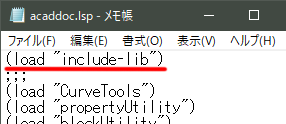
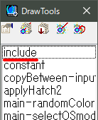
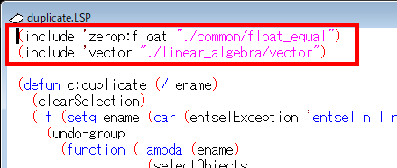
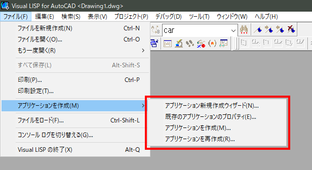
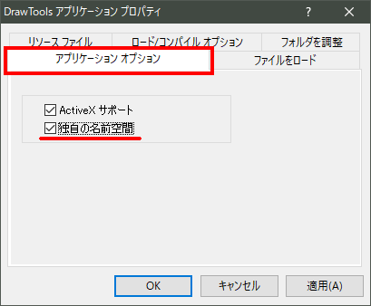
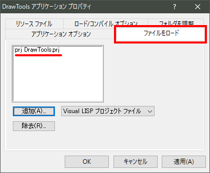
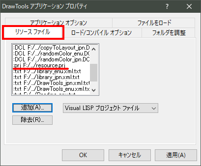

# include


# 概要

AutoLISP には load 関数があり、他のファイルから必要な関数をロードすることができます。しかしそれは単純な動作のため、常にロードされるファイルを把握しておかなければなりません。そのため、必要な関数を自動でロードするライブラリのようなシステムを Visual LISP IDE 上では、そのままでは利用できません。ここでは、load 関数を拡張した include 関数を定義してライブラリシステムを構築していきます。include 関数と load 関数との主要な違いは、既にロードしたファイルは記憶しておいて不要なロードは行いません。

include 関数を前提とした既存のライブラリに加えて、あなたの作った再利用性の高い独自の関数を、今書いているプログラムとは別のフォルダに同じ要領で整理することで、あなた自身のライブラリを作っていくことができます。

このシステムを構築すると自動で関数がロードされる一方で、どの関数がロードの対象になるのか把握することは困難になります。そのため開発に使った AutoLISP 実行環境以外にプログラムを他で利用することは困難になります。そのため、最終的にあなたの書いたプログラムと必要なライブラリの関数を合わせて一つの【独自の名前空間 VLX アプリケーション】として仕上げることが必要になります。【独自の名前空間 VLX アプリケーション】とすることで、一つのファイルで扱いやすく、他の AutoCAD ユーザーの AutoLISP 実行環境においても干渉せずに動作するプログラムとすることができます。

include 関数がロードして記憶しておいた関数のファイルのリストを Visual LISP のプロジェクトファイルの形式に書き出すことができます。これは、あなたのプログラムを【独自の名前空間 VLX アプリケーション】として仕上げる際にアプリケーション定義ファイルのリソースとして使用できます。

# ライセンスについて

本関数のソースコードについては、MIT ライセンスとします。MIT ライセンスはオープンソースソフトウェアのライセンスの一つで、制約が少ししかないものです。

MIT ライセンスのあらましを本件にあわせて意訳すると以下の通りです。
* 無保証です！
* 本関数のソースコードは誰でも無料で使用できます。商用を含めて、自由にソースコードの配布や変更を行うこと、これ使ったプログラムの作成ができます。
* 本関数のソースコードの再配布や変更を行う場合、これらに既に含まれている下記の著作権表示は消してはいけません。また、この関数を使用して作成したあなたのプログラムを配布しようとするときの著作権表示には、同じく下記の著作権表示の三行を、同梱するライセンス表示用の別ファイルなど適当な、しかし確認できるところに明示してください。
```
Copyright (c) 20xx manual chair japan
Released under the MIT license
https://opensource.org/licenses/mit-license.php
```

# 使用法

## STEP 1 - ライブラリシステムの構築

### サポートファイルの検索パスの設定

1. AutoCAD の【サポートファイルの検索パス】の設定をする。

ライブラリへのパスの設定を行います。include 関数を前提とした他から入手したライブラリやあなたが独自に作ろうとしているライブラリを置くフォルダは、あなたが好きなところに置くことができます。しかしそこまでのパスは AutoCAD の【サポートファイルの検索パス】の設定を行ってください。この設定は、AutoCAD の OPTIONS コマンドで表示されるダイアログの【ファイル】タブから設定できます。


 
AutoCAD のバージョンによっては【信頼できるフォルダ】に該当のフォルダを含める設定を行ってください。

### include 関数の定義

2. AutoCAD の AutoLISP 開発環境に include 関数をロードして使用可能にする。

include 関数はライブラリから関数をロードします。この関数は **include-lib.LSP** ファイルを acaddoc.LSP などから前もって開発環境にロードしておきます。



このファイルをロードすると、include 関数の定義と、この関数を使ってロードしたファイルの一覧を Visual LISP のプロジェクトファイルに書き出す exportresouce 関数が定義されます。また、グローバル変数 \*DrawingLevelEnviromet\* が T にセットされます。

以上でライブラリシステムの設定は終わりです。

以降のプログラムの開発作業は Visual LISP のプロジェクト機能を使って行った方がスムーズです。

## STEP 2 - プログラムを開発する

### 独自の名前空間 VLX アプリケーション用の include 関数

3. あなたのプロジェクトの先頭に【独自の名前空間 VLX アプリケーション】用の include 関数を登録する。

あなたのプログラムを最終的に【独自の名前空間 VLX アプリケーション】として仕上げた場合、ライブラリの関数はリソース内から実行コードがロードされます。この際は、開発時に使用していた include 関数とは別のリソースをターゲットにした内容が定義された include 関数を使用するようにします。この関数は **include.lsp** に定義されています。

このファイルは、あなたが作ろうとしているプログラムのプロジェクトファイルの先頭に登録しておくなどして【独自の名前空間 VLX アプリケーション】に含まれるようにします。この include 関数はファイルがプロジェクトに登録されていても  \*DrawingLevelEnviromet\* が  T  の間は定義がスキップされ、【独自の名前空間 VLX アプリケーション】内でのみ活性化します。	 



### include ステートメント

4. あなたのプログラムに include 関数のステートメント書いておく。

include 関数で適時ライブラリの関数をロードしながら、あなたのプログラムを完成させてください。あなたのプログラムには次のようなステートメントを記述すると必要な関数が書かれたファイルが必要に応じてライブラリからロードされるようになります。

```lisp
(include 'default "./common/default")
```

include 関数の最初の引数が必要な関数の関数名、第二引数は関数が定義されたファイル名を表します。上の例の場合は、default 関数が定義されていなければ、"./common/default" ファイルをロードせよ、という意味になります。ファイル名は、AutoCADの【サポートファイルの検索パス】からの相対パスで記述されています。



## STEP 3 - 独自の名前空間 VLX アプリケーションの作成

### ライブラリ関数一覧のプロジェクトファイルを作成

5. exportresouce 関数を使って、利用しているライブラリ関数の一覧をプロジェクトファイルに書き出す。

あなたのプログラムが完成したら、【独自の名前空間 VLX アプリケーション】の作成に向けてライブラリから使用している関数の一覧を Visual LISP のプロジェクトファイルの形で書きだします。この作業は開発過程で include 関数がロードしたものを書き出すものですから、試行錯誤の間に不要な関数がロードされているかもしれません。そのため、一度 AutoLISP 実行環境をリセットしてから改めてあなたのプログラムをロードして、不要なものが含まれていない状態で行ってください。exportresouce 関数を【コンソール】から実行すると、ファイルを保存するダイアログが出るので、ファイル名を指定して保存を行ってください。

```lisp
_$ (exportresource) ⏎

; Resouce files was exported as project file.
; F:\VisualLISP\resource\DrawTools\resource.prj
```

### 一時フォルダの確認

6. ライブラリ関数一覧のプロジェクトファイル内の一時フォルダについて確認する。

先ほど作成したライブラリ関数一覧のプロジェクトファイルのコンパイルに関するオプションで使用する一時フォルダは、このプロジェクトファイルを置いた場所の temp フォルダに決め打ちとなっています。

必要に応じて、プロジェクトファイルを開いてフォルダを変更するか該当のフォルダを作る作業を行ってください。

```lisp
  :FAS-DIRECTORY
  "./temp"
  :TMP-DIRECTORY
  "./temp"
```

### アプリケーション定義ファイルを設定

7. 【アプリケーションのオプション】タブで【独自の名前空間】にチェックを入れる。
8. 【ファイルをロード】にあなたのプロジェクトファイルを登録する。
9. 【リソースファイル】のタブにライブラリ関数一覧のプロジェクトファイルを登録する。
10. Visual LISP の【ファイル】→【アプリケーションを作成】からVLXアプリケーションを作成する。

Visual LISP のメニュー【ファイル】→【アプリケーションを作成】→【アプリケーション新規作成ウィザード】または【既存のアプリケーションのプロパティ】を使って【VLX アプリケーション】定義ファイルの設定を行っていきます。
 


【～ アプリケーションのプロパティ】ダイアログの【アプリケーションのオプション】タブで【独自の名前空間】にチェックを入れてください。
 


次に【ファイルをロード】タブに、あなたが作成したプログラムのプロジェクトファイルを登録します。
 


ライブラリの関数一覧を記録したプロジェクトファイルは【リソースファイル】のタブに登録します。
 


その他のアプリケーションの設定はあなたの環境に合わせて適時設定してください。

以上の設定が出来たら Visual LISP のメニュー【ファイル】→【アプリケーションを作成】→【アプリケーションを作成】または【アプリケーションを再作成】から【VLX アプリケーション】を作成します。

再度 AutoLISP 実行環境をリセットしてから、作成された【VLX アプリケーション】をロードしてきちんと動作するかテストしてください。

### VLX アプリケーションのロード時のトラブル

APPLOAD コマンドから完成した【VLX アプリケーション】を AutoCAD にロードして「～が正常にロードされました」と表示されても、ロード中にエラーが発生してプログラムが実行できない場合があります。開発時に正常に動いていたならば、ほとんどの場合は【独自の名前空間 VLX アプリケーション】内にライブラリ関数をパックするのに漏れがあったのが原因です。次のことを確認して、再度【VLX アプリケーション】を作成してみてください。

* 再度、ライブラリ関数一覧のプロジェクトファイルを作成して最新の状態にする。

* 既に一度【VLX アプリケーション】を作成していたならば、作成時に前回のライブラリ関数一覧のプロジェクトファイルが Visual LISP で開かれています。開かれたプロジェクトが、ファイルの内容より優先されるので以前のプロジェクトを【プロジェクト】→【プロジェクトを閉じる】から確実に閉じてください。

* 以上の対応でも解決できない場合、Visual LISP を開いた状態で APPLOAD コマンドから【VLX アプリケーション】のロードの失敗を再現してみます。そこで Visual LISP の【エラートレース】を表示させると、何がエラーとなっているか情報を得られる場合があります。ここでの原因は、外部【ObjectARX アプリケーション】による関数を独自の名前空間へインポートし忘れていた事などが考えられます。このような場合は、例えば次のような宣言をプログラムに含めます。

       (vl-arx-import 'startapp)

(EOF)